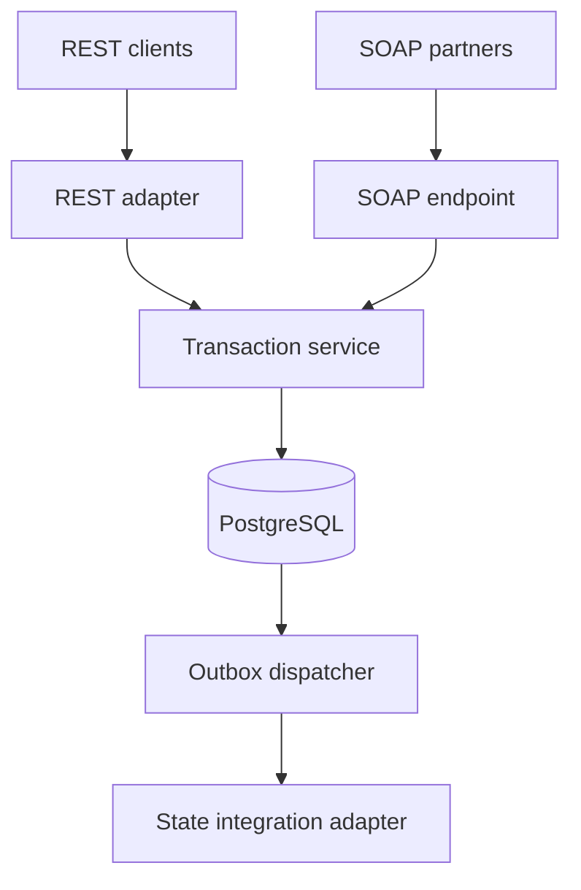
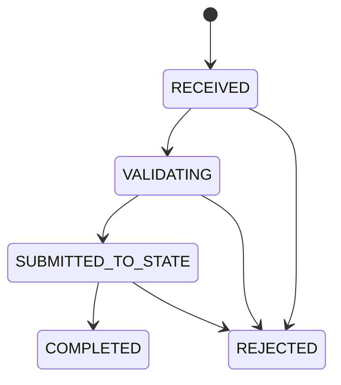

# Vehicle Title Transaction API

A production-minded Java 21 service for reliable vehicle-to-government title
workflows. It exposes the same transaction capabilities through modern REST and
contract-first SOAP interfaces while protecting record integrity across retries,
concurrent callbacks, and downstream failures.

## Why this project

Vehicle title integrations combine long-running state workflows, legacy SOAP
contracts, newer REST clients, jurisdiction-specific data, and strict audit needs.
This project focuses on those engineering constraints rather than generic CRUD.

## Highlights

- Java 21 virtual threads and Spring Boot 3
- Contract-first SOAP with a versioned XSD, generated JAXB models, WSDL, and SOAP faults
- REST API with OpenAPI/Swagger documentation and RFC 9457 Problem Details
- PostgreSQL persistence with Hibernate/JPA and Flyway migrations
- Payload-aware idempotency keys backed by a database uniqueness constraint
- Controlled transaction state machine with locked status updates
- Immutable audit history across REST and SOAP channels
- Transactional outbox with bounded exponential-backoff retries
- API-key authentication, request validation, correlation IDs, health probes, and metrics
- Docker Compose, Kubernetes manifests, GitHub Actions, JaCoCo, and ArchUnit

## Architecture



The REST and SOAP layers contain protocol mapping only. Business rules live in a
shared application service and domain model. See
[architecture decisions](docs/architecture-decisions.md) for the tradeoffs.

## Transaction lifecycle



## Run locally

Requirements: Docker with Compose.

```bash
docker compose up --build
```

The local API key is `local-development-key`.

- Swagger UI: <http://localhost:8080/swagger-ui.html>
- SOAP WSDL: <http://localhost:8080/ws/title-transactions.wsdl>
- Health: <http://localhost:8080/actuator/health>
- Prometheus metrics: <http://localhost:8080/actuator/prometheus>

REST requests are available in [`examples/rest-api.http`](examples/rest-api.http).

## REST API

| Method | Path | Purpose |
|---|---|---|
| `POST` | `/api/v1/title-transactions` | Submit or safely replay a transaction |
| `GET` | `/api/v1/title-transactions/{id}` | Read a transaction |
| `GET` | `/api/v1/title-transactions?vin={vin}` | Find the history for a VIN |
| `PATCH` | `/api/v1/title-transactions/{id}/status` | Advance the controlled lifecycle |
| `GET` | `/api/v1/title-transactions/{id}/audit-events` | Read the audit history |

Every protected REST request requires `X-API-Key`. Submission also requires an
`Idempotency-Key` header.

## SOAP API

The contract lives at
[`src/main/resources/xsd/title-transactions-v1.xsd`](src/main/resources/xsd/title-transactions-v1.xsd).
Maven generates the binding classes during `generate-sources`; Spring-WS publishes
the WSDL at runtime.

```bash
curl --fail-with-body http://localhost:8080/ws \
  -H 'Content-Type: text/xml; charset=utf-8' \
  -H 'X-API-Key: local-development-key' \
  --data-binary @examples/soap-submit.xml
```

Available operations:

- `SubmitTitleTransaction`
- `GetTitleTransaction`

SOAP idempotency is part of the request contract. Invalid requests, conflicting
idempotency keys, and missing transactions are returned as client SOAP faults.

## Reliability behavior

When a submission commits, three records are written atomically:

1. The current title transaction.
2. An immutable audit event.
3. A pending integration event in the outbox.

The dispatcher provides at-least-once delivery and exponential backoff. A production
Kafka, Pub/Sub, or agency SOAP adapter can replace the logging publisher behind the
`OutboxPublisher` interface.

## Tests

```bash
mvn clean verify
```

The suite covers domain transitions, idempotent replay and conflicts, audit creation,
API authentication, contract-first SOAP requests and faults, outbox backoff, and
architectural dependency rules. GitHub Actions runs the suite with Java 21 and uploads
Surefire and JaCoCo reports.

## Configuration

| Variable | Purpose | Local default |
|---|---|---|
| `DATABASE_URL` | PostgreSQL JDBC URL | `jdbc:postgresql://localhost:5432/vehicle_titles` |
| `DATABASE_USERNAME` | Database user | `vehicle_titles` |
| `DATABASE_PASSWORD` | Database password | `vehicle_titles` |
| `APP_API_KEY` | Partner API credential | `dev-secret-change-me` |

Never use the local defaults in a deployed environment. Kubernetes values are split
between a ConfigMap and a Secret example under [`k8s/`](k8s/).

## Technology

Java 21 with virtual threads, Spring Boot 3, Spring Web Services, Spring Security, Hibernate/JPA,
PostgreSQL, Flyway, Maven, JUnit 5, MockMvc, Spring-WS Test, ArchUnit, Docker,
Kubernetes, GitHub Actions, OpenAPI, Actuator, and Prometheus.
